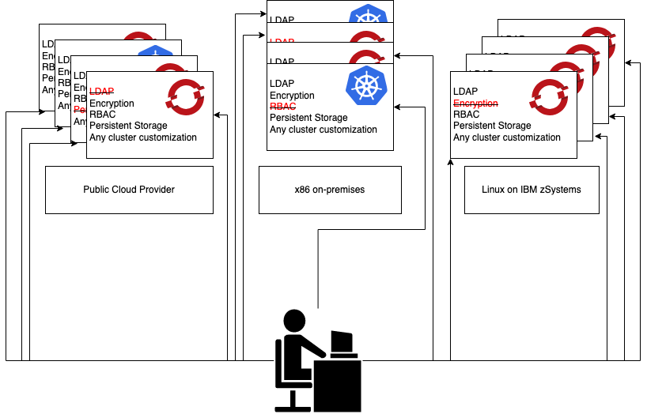

# Red Hat Advanced Cluster Management with Multiarchitecture OpenShift

Red Hat Advanced Cluster Mangement (RHACM) provides the tools and capabilities to address various challenges with managing multiple clusters and consoles, distributed business applications, and inconsistent security controls across Kubernetes clusters that are deployed on-premises, or across public clouds.

The demonstration in this respository focuses on **consistent application and infrastructure as code deployments across multiarchitecture Kubernetes clusters**. However, RHACM provides numerous other capabilities related to cluster creation and updating, Ansible automation, and governance that will not be covered in this demonstration.

## Table of Contents

- [Red Hat Advanced Cluster Management with Multiarchitecture OpenShift](#red-hat-advanced-cluster-management-with-multiarchitecture-openshift)
  - [Table of Contents](#table-of-contents)
  - [Prerequisites](#prerequisites)
  - [Background](#background)
  - [Understanding RHACM](#understanding-rhacm)
  - [Installing RHACM](#installing-rhacm)
  - [Importing OpenShift Clusters into RHACM](#importing-openshift-clusters-into-rhacm)
  - [Exploring RHACM](#exploring-rhacm)
  - [Understanding RHACM Applications](#understanding-rhacm-applications)
  - [About the Sample Application](#about-the-sample-application)
  - [Deploying Applications across Multiarchitecture OpenShift Clusters](#deploying-applications-across-multiarchitecture-openshift-clusters)
  - [Automated Application Updates](#automated-application-updates)
  - [Deploying Infrastructure-as-a-Service across Multiarchitecture OpenShift Clusters](#deploying-infrastructure-as-a-service-across-multiarchitecture-openshift-clusters)
  - [Wrap Up](#wrap-up)
  - [More Resources](#more-resources)

## Prerequisites

1. `oc` and `kubectl` CLIs installed.
2. [GitHub](https://github.com/) account with basic knowledge of how to clone and edit repositories.
3. OpenShift cluster on IBM zSystems or LinuxONE
4. OpenShift cluster on x86-based infrastructure (on premises or in a public cloud)
   1. Alternatively, any platform listed as supported [here](https://access.redhat.com/articles/6968787)
5. Meet the network connectivity requirements explained [here](https://access.redhat.com/documentation/en-us/red_hat_advanced_cluster_management_for_kubernetes/2.6/html/networking/index#doc-wrapper).
6. Cluster administrator authority for both OpenShift clusters
7. Basic OpenShift knowledge - how to log in to the console and CLI, navigation and use of each 
   
## Background

As IT organizations adopt the hybrid multicloud model, Kubernetes clusters have a tendency to proliferate across IT environments, becoming more difficult to manage and maintain in a consistent manner. It's no small task for cloud administrators to keep track of which clusters are running certain applications. For example, if there is a business critical application that is required to run on both two x86 OpenShift production clusters in different regions, as well as an OpenShift cluster running on IBM zSystems, they would need to go on three different OpenShift clusters (likely owned by separate teams) and manually check that all of the application components are running and in good health. Then whenever that application needs to be updated, they need to again connect to three different OpenShift clusters, remove the existing applications, deploy the updated applications, make sure everything works, and manually check that all three applications are deployed the same, or create homegrown automation to do this for them. This might be feasible for three OpenShift clusters, but what if you have teams spinning up new Kubernetes clusters every day in public clouds? What if your organization starts working with Internet of Things (IoT) devices that each has their own mini Kubernetes cluster on each device? How many clusters can you manually maintain - a dozen? One hundred? 

**There comes a point in hybrid multicloud environments where cloud administrators needs some automation and a single source of truth for application management and maintenance.**


Another scenario - forget the applications... how can the cloud administrator make sure that all three (dozen? (hundred? (thousand??))) clusters themselves are consistent? Are they expected to manually configure each cluster for persistent storage, required operators, LDAP integrations, etcd encryption, role-based access control, and the hundred other customizations performed when a new cluster is created? And again, what if something changes? What if a new version of an operator is released and it needs to be installed on each cluster? What if someone leaves the company and their access needs revoked from every cluster?

**As with applications running in hybrid cloud environments, the Kubernetes clusters themselves require a standardized and automated model to maintain consistency.**



## Understanding RHACM

RHACM can help with both of the scenarios described above. Cluster administrators or Site Reliability Engineers (SREs) can manage both *applications* and Kubernetes *infrastructure* from a single pane of glass. RHACM supports GitOps methodology where a Git repository (such as GitHub) acts as the single source of truth for application and infrastructure code, then RHACM deploys the contents of the Git repository to desired clusters through a system of label matching. 

(1).png)

*You may need to open this full image in a new tab to see it better.*

After the application or infrastructure is deployed to the Kubernetes clusters, RHACM then constantly watches both the deployed application/infrastructure as well as the Git repository "source of truth". So whenever the code is updated in the Git repository, RHACM will automatically push those updates into the Kubernetes clusters. The reverse scenario is also true - if an application or infrastructure on Kubernetes changes, RHACM will automatically apply the Git repository to bring the applications/infrastructure back in sync.

Other than the obvious benefits of automation, speed, and consistency, one of the less-frequently discussed benefits of this GitOps methodology is the reduction of Kubernetes access and skills required by developers. With RHACM and GitOps, developers only have to worry about development and do not need to be given access to OpenShift or need to know how to deploy an application on OpenShift. They just have to commit and push updates to Git the same way they always have, and their application will automatically propogate to all desired OpenShift clusters in a consistent manner. No more looking up how to deploy an application, forgetting how to create a configMap, or needing to expose the application as a route with the proper hostname. That's all taken care of for you.

One thing to remember, Git is a source code management tool. Some of the benefits of Git are version control, visibility into who made which changes, and the ability to roll back to a previous version or point in time. Because Git is the source of truth that RHACM deploys from, the applications or infrastructure deployed by RHACM adopt these benefits as well. You can easily track who made changes and when they were made, and you can roll back those changes to a known state in Git if need be. With RHACM, this concept extends to entire OpenShift clusters. You can create, recreate, or recover clusters from a known state. This level of visibility and control over as many Kubernetes clusters as you wish was unprecedented before GitOps.

## Installing RHACM

RHACM is a containerized application deployed as an operator on an OpenShift cluster, known as the *Hub cluster*. RHACM and this Hub cluster have visibility into, and control of, other Kubernetes clusters known as *Managed clusters*.

This demonstration assumes you will install RHACM on an OpenShift on x86 cluster. This is an arbitrary decision and if you would rather install RHACM on zSystems, that works just as well. (Or any of the other architectures listed in the "Supported for Hub" column [here](https://access.redhat.com/articles/6968787)).

1. From the Hub OpenShift cluster, navigate to the OperatorHub and search for Red Hat Advanced Cluster Management.

2. Click the Install button

3. Select your desired Update Channel. Typically the latest version is the best choice.

4. Leave the default settings for the remaining options and click Install.

    

5. Once the operator is installed, click the Create MultiClusterHub button.

    If you have navigated away from the installation page, you can find this button by navigating in the OCP console to Administrator -> Operators -> Installed Operators -> Advanced Cluster Management for Kubernetes.

1. Leave the default options and click the Create button.

2. After installing the MultiClusterHub, access the RHACM console from the OpenShift console by clicking on the Administrator dropdown and changing to Advanced Cluster Management.

    

1. Log in with your OpenShift credentials.

  You now have RHACM installed on the x86 Hub cluster. The next step is to configure RHACM to manage an OpenShift cluster on IBM zSystems.

## Importing OpenShift Clusters into RHACM

1. In the RHACM console, navigate to Infrastructure -> Clusters.

    RHACM is capable of both *creating new OpenShift clusters*, and *importing existing OpenShift clusters*. In this case, because [you already have](#prerequisites) an existing OpenShift on IBM zSystems cluster, you will be importing it.

1. Click the Import Cluster button.

1. Provide a distinguishable name for the managed IBM zSystems cluster. 

    For example, because the IBM zSystems cluster used when developing this demo is named `atsocpd1`, a distinguishable name would be `atsocpd1-s390x`.

1. Next, select "Enter your server URL and API token for the existing cluster" for the Import mode.

    There are other ways to import a cluster as well, but the end result will be the same.

1. Enter your server URL. This can be found in the web console overview page, or by entering `oc cluster-info` in a command line while connected to the cluster.

2. Enter an API token. This can be found in the OCP web console with the "Copy login command" option under your username in the top right of the page. Alternatively, you can enter `oc whoami -t` when connected via a command line.

1. Click the next button.

4. Skip the automation page. 

    As mentioned in a previous section, RHACM supports the use of Ansible playbooks to run at different stages of the cluster lifecycle. This integration allows for customization or remediation of OpenShift clusters using Ansible playbooks. This is outside the scope of this demonstration, however cool it is.

5. On the Review page, click the Generate command button.

    You will be taken to a new page for the yet-to-be imported OpenShift on IBM zSystems cluster. 

6. Log in to your managed OpenShift on IBM zSystems cluster using the `oc` command line. 

7. Click the Copy command button from the RHACM console, and paste it into your CLI session where you are logged into OpenShift.

    This will paste a *quite* long command made up of base64 encoded information.

    After the commmand runs, you will see various objects created in the managed cluster:

    ```text
    customresourcedefinition.apiextensions.k8s.io/klusterlets.operator.open-cluster-management.io created
    namespace/open-cluster-management-agent created
    serviceaccount/klusterlet created
    clusterrole.rbac.authorization.k8s.io/klusterlet configured
    clusterrole.rbac.authorization.k8s.io/open-cluster-management:klusterlet-admin-aggregate-clusterrole unchanged
    clusterrolebinding.rbac.authorization.k8s.io/klusterlet unchanged
    deployment.apps/klusterlet created
    secret/bootstrap-hub-kubeconfig created
    klusterlet.operator.open-cluster-management.io/klusterlet created
    ```

    And after a minute or so, you will see the IBM zSystems cluster information start to populate the RHACM console.

    

    RHACM can now manage this OpenShift on IBM zSystems cluster by updating it, hibernating nodes, deploying applications to it, deploying infrastructure or configuration changes to it, enforcing govenance rules and all of the other great capabilities provided by RHACM.

## Exploring RHACM

Before using RHACM to deploy an application to the managed OpenShift cluster, you should get more familiar with navigating the RHACM console. 

1. Use the left-side menu to go back to the overall Clusters page.

    

    Notice on this page that RHACM automatically identified the Status, Infrastructure, Version, and other information about the two clusters that it stored as labels. One thing to note - even though RHACM is running on an x86 architecture (VMware vSphere) cluster, it will have no problem managing and deploying to the IBM zSystems cluster.

    The `local-cluster` listed on this page is the Hub cluster where RHACM is running. So you have a situation where RHACM can manage and deploy the OpenShift cluster that it is running on. 

    From this page you can upgrade or hibernate/resume clusters. Updating clusters from RHACM makes it easier to be sure that clusters are all at the correct versions without having to log into each one individually. Hibernating clusters can be a good idea, especially for public-cloud based clusters, because it will temporarily shut down the cluster nodes when they arent needed, saving an organization money.

    From this page, you can also put clusters into Cluster Sets or Cluster Pools. 

    - Cluster Sets essentially group cluster resources together so that you can manage all of their resources with one set of role-based access controls. This can be useful for teams who need to use multiple clusters as if they were one single entity, and also allows for inter-cluster network connectivity with [Submariner](https://submariner.io/).

    - Cluster Pools are pools of multiple clusters that can be made available for checkout by developers or for use by temporary workloads. When the clusters aren't checked out, they are in a hibernating state so as to reduce cloud provider cost.

1. Navigate to the Overview page using the left-side menu.

    On the Overview page, you can see overall information for all of the managed (and Hub) clusters. Although there are only two clusters involved for this demonstration, you can imagine how helpful it would be to find information about cluster fleet health and status if there were dozens, hundreds, or thousands of clusters being managed.

    

    You might notice that RHACM has found zero applications in the two clusters. The reason for this is that an Application is a concept specific to RHACM - this is not an application in the sense of a OpenShift deployment or pod running on a cluster. 

    You will learn more about RHACM Applications (and deploy one) in the next section.

## Understanding RHACM Applications

RHACM uses a combination of Kubernetes objects and its [own specific components](https://access.redhat.com/documentation/en-us/red_hat_advanced_cluster_management_for_kubernetes/2.6/html/about/welcome-to-red-hat-advanced-cluster-management-for-kubernetes#red-hat-advanced-cluster-management-for-kubernetes-terms) related to multicluster management. Just like Kubernetes objects, RHACM objects are defined in [YAML](https://www.redhat.com/en/topics/automation/what-is-yaml).

For the next few explanations of terms, refer to the image below (from the [RHACM documentation](https://access.redhat.com/documentation/en-us/red_hat_advanced_cluster_management_for_kubernetes/2.6/html-single/applications/index#application-model-and-definitions).) You can also find more details about the RHACM application model at the same link.


When deploying infrastructure-as-code or containerized Kubernetes applications with RHACM, the highest level resource is an **Application** (see how this can be confusing?). *A RHACM Application is used to group Kubernetes objects that make up an applicatio*n. RHACM can also discover Applications installed on managed OpenShift clusters that were deployed with the Red Hat GitOps or ArgoCD operators. In their YAML definitions, Applications refer to our next term, Subscriptions.

**Subscriptions** are the RHACM object that allow clusters to *subscribe* to source repositories such as Git, Helm, or Object storage repositories. For this, Subscriptions refer to Channels.

*Note*: This demonstration focuses on the GitOps approach to mutlicluster management, so Helm and Object storage are outside of the current scope. If you would like to learn more about them, you can read more [here](https://access.redhat.com/documentation/en-us/red_hat_advanced_cluster_management_for_kubernetes/2.6/html-single/applications/index#managing-apps-with-helm-cluster-repositories) and [here](https://access.redhat.com/documentation/en-us/red_hat_advanced_cluster_management_for_kubernetes/2.6/html-single/applications/index#managing-apps-with-object-storage-repositories).

Subscriptions have the added responsibility of managing *where* the source repository objects will be deployed. For this, subscriptions refer to Placement Rules.

**Channels** represent the Git repository that is the single "Source of Truth" discussed earlier in this demonstration. Supported Git repositories include [GitHub](https://github.com/), [GitLab](https://about.gitlab.com/), [Bitbucket](https://bitbucket.org/), and [Gogs](https://gogs.io/). You can also use private/entitled Git repositories in a seucre way by storing access credentials in a Kubernetes secret. 

**Placement Rules** are used by RHACM to define which target clusters an Application will deploy to. This can be defined by specifying labels or Cluster Sets. 

Now that you know RHACM Applications and their components, next you will create one from the RHACM console.

## About the Sample Application

The application you will be deploying to the managed clusters can be found here: <https://github.com/mmondics/national-parks>. This sample application includes frontend, backend, and database deployments that display a map of the locations of national parks in the United States. The [frontend](https://github.com/mmondics/national-parks/tree/main/source/parksmap-web) is written in Java and integrates a [Leaflet map](https://leafletjs.com/). The [backend](https://github.com/mmondics/national-parks/tree/main/source/nationalparks-py) is written in python and contains the name, coordinates, and more information about each national park. The [database](https://github.com/mmondics/national-parks/blob/main/yaml/separate/national-parks-backend.yaml) is simply a prebuilt MongoDB image that will be loaded with data from the backend.

All three of these container images - frontend, backend, and database - have been built to be multiarchitecture. That is, the single container image manifest you will soon deploy will run on x86, IBM zSystems, or IBM Power OpenShift clusters (ARM64 as well, with the exception of the Mongo database).

In this GitHub repository, you can find both the source code used to create the container images, as well as all of the Kubernetes YAML files for the various Deployments, Services, Routes, RoleBindings, and a Secret. Note that storing Secrets in your Git repository is **NOT** best practice and should not be done in a production environment. Do as I say, not as I do...

There are two subdirectories under [yaml](https://github.com/mmondics/national-parks/tree/main/yaml) - `combined` and `separate`. `Combined` includes all of the Kubernetes objects together, while `separate` has two YAML files, one for the frontend applciation and one for the backend + database. The reason for this is simply because this application is used for various purpose where the frontend+backend sometimes need decoupled. In this demo, we will be using the `combined` YAML file.

## Deploying Applications across Multiarchitecture OpenShift Clusters

First we need to do some preparation so that RHACM knows where to deploy the Application. 

1. In the RHACM console, navigate to the clusters page. 

1. For both of the two clusters, click the three dots to the far right and edit the labels.

    

1. Add a new label `demo=multiarch`, hit tab, and click Save. 

    You should see the new label added to the list.

2. Repeat for the second cluster.

3. In the RHACM console, navigate to the Applications page, click the Create application button, and Select Subscription.

    

    *ApplicationSets* are a subproject of ArgoCD and work very similarly to Subscriptions. Thus they are a GitOps-native object that is supported by RHACM. However, they require ArgoCD to be deployed to each OpenShift cluster so they will not be used in this demonstration.

4. For Name, enter `national-parks-multiarch`

5. For Namespace, enter `national-parks-rhacm`

    Because you most likely do not have projects with this name, they will be created. This is only possible to do if you have cluster-admin authority.

6. For Repository type, select Git.

7. For URL, enter your clone of the following GitHub repository: `https://github.com/mmondics/national-parks`
   
    Note: you should use [your own clone](#prerequisites) of this repository because a later step will require that you edit a file.

8. For Path, enter `yaml/combined`

9.  Under Select clusters for application deployment, for Label, enter `demo`, and for Value, enter `multiarch`. 

    This will create a Placement for the two clusters you labeled with `demo=multiarch`.

    All other options can be left blank or as their defaults. If you have the YAML option on, you will have noticed the YAML form on the right being filled out based on the values you provided.

10. Click the Create button in the top-right.

    Shortly after creating the Application, you will be taken to a new screen showing its status and some other details.

    

11. Click on the Topology tab.

    If you did everything correctly, you should see a topology view of all of the Application components created similar to the image below.

    

    From this view, you can see the name, type, status, and count of each object created.

    For example, zooming in on the Route named `parksmap`.

    

    You see that there are two instances of the parksmap route (one on each OCP cluster) and both are healthy.

12. Click on some of the topology icons to see the information they provide. 

    Different object types provide information relevant to their function. For example, pods will provide access to pod logs while routes will provide access to the route URL. 

    You will also see these objects are created in the two OpenShift clusters.

13. While logged in with the `oc` CLI, run the following command to see the objects in each OpenShift cluster.

    `oc get all -n national-parks-rhacm`

    ```text
    ➜  ~ oc get pod -n national-parks-rhacm
    NAME                                     READY   STATUS    RESTARTS   AGE
    mongodb-nationalparks-569d8f967b-xd4zq   1/1     Running   0          119m
    nationalparks-6f4b8858d5-d5q75           1/1     Running   0          119m
    parksmap-84c87669d7-g7f5t                1/1     Running   0          119m
    ➜  ~ oc get all -n national-parks-rhacm
    NAME                                         READY   STATUS    RESTARTS   AGE
    pod/mongodb-nationalparks-569d8f967b-xd4zq   1/1     Running   0          125m
    pod/nationalparks-6f4b8858d5-d5q75           1/1     Running   0          125m
    pod/parksmap-84c87669d7-g7f5t                1/1     Running   0          125m

    NAME                            TYPE        CLUSTER-IP      EXTERNAL-IP   PORT(S)     AGE
    service/mongodb-nationalparks   ClusterIP   172.30.212.76   <none>        27017/TCP   125m
    service/nationalparks           ClusterIP   172.30.46.241   <none>        8080/TCP    125m
    service/parksmap                ClusterIP   172.30.28.73    <none>        8080/TCP    125m

    NAME                                    READY   UP-TO-DATE   AVAILABLE   AGE
    deployment.apps/mongodb-nationalparks   1/1     1            1           125m
    deployment.apps/nationalparks           1/1     1            1           125m
    deployment.apps/parksmap                1/1     1            1           125m

    NAME                                               DESIRED   CURRENT   READY   AGE
    replicaset.apps/mongodb-nationalparks-569d8f967b   1         1         1       125m
    replicaset.apps/nationalparks-6f4b8858d5           1         1         1       125m
    replicaset.apps/parksmap-84c87669d7                1         1         1       125m

    NAME                                     HOST/PORT                                              PATH   SERVICES        PORT       TERMINATION   WILDCARD
    route.route.openshift.io/nationalparks   nationalparks-national-parks-rhacm.apps.atsocpd2.dmz          nationalparks   8080-tcp                 None
    route.route.openshift.io/parksmap        parksmap-national-parks-rhacm.apps.atsocpd2.dmz        /      parksmap        8080-tcp                 None
    ```

    *Hint*: when working with multiple OpenShift clusters, you can easily direct your `oc` commands at a specific cluster by using the `--context` flag. This way you don't need to log in and out of individual clusters when you want to change which one you're working with. You can also rename your context to something easier to remember to and type.

    ```text
    ➜  ~ oc config get-contexts | grep x2pn
          default/api-x2pn-dmz:6443/kube:admin                        api-x2pn-dmz:6443                  kube:admin/api-x2pn-dmz:6443                                                       default

    ➜  ~ oc config rename-context default/api-x2pn-dmz:6443/kube:admin x2pn
    Context "default/api-x2pn-dmz:6443/kube:admin" renamed to "x2pn".

    ➜  ~ oc --context x2pn -n national-parks-rhacm get pods
    NAME                                    READY   STATUS    RESTARTS   AGE
    mongodb-nationalparks-b47d5968b-qbpph   1/1     Running   0          136m
    nationalparks-5d4647475f-fcc6m          1/1     Running   0          136m
    parksmap-684fdf7bfc-hpxg2               1/1     Running   0          136m
    ```
14. Using either the RHACM topology view, the OpenShift console, or the `oc get routes` command, navigate to the nationalparks (backend) route for both the x86 and s390x versions of the national parks application.

    You should see a single line of text saying `Welcome to the National Parks data service.`

15. For both routes, append `/ws/data/load` to the end of each URL

    For example, your routes should be something like:
    
     `nationalparks-national-parks-rhacm.apps.example.com/ws/data/load`
    
16. If done correctly, you should see some JSON returned that says `"Items inserted in database: 204"`.

17. Remember to repeat this for both nationalparks routes.

18. Now navigate to the parksmap (frontend) routes either from the RHACM topology, OpenShift console, or by finding the route URL from the `oc` CLI.

    

    Notice that you have the idential frontends, backends, databases, and data even though one cluster is running on x86, and the other is on IBM zSystems. 

    You can interact with the application by clicking on markers to see information about each national park or change the map type with the options in the top-left corner.

## Automated Application Updates

Now assume there's a developer who needs to push an update to the application. This developer does not have access to OpenShift or know the first thing about deploying an application on Kubernetes - all they know is how to update the source code, push that update through the containerization process (varies by organization), and have that change reflected in the Git repository.

For this demo, you do not need to make any code changes. A minor code change has already been made and a new container image has been built with the update, so all you need to do is update the YAML file to reference the new image.

1. In your fork of the national parks GitHub repository (<https://github.com/mmondics/national-parks>), navigate to `yaml/combined/` and edit the YAML file `national-parks-combined.yaml`.

    Edit line 35 to use the tag `v2-update`, rather than `latest`.

    The edited line and those surrounding it should look like the following:

    ```yaml
        - name: parksmap
          image: >-
            quay.io/mmondics/national-parks-frontend:latest
          ports:
            - containerPort: 8080
              protocol: TCP
    ```

    When you are done editing the file, commit and push the update.

1. Navigate back to your RHACM topology view for the `national-parks-multiarch` Application and find the Pod named `parksmap`.

    Depending how quickly you navigated back to the topology, you might catch the `parksmap` Pod with a warning symbol on it, indicating that there is an issue. If you don't catch it, here is what it looks like:

    

    Navigate back to one of the frontend parksmap routes (where you can see the map) and notice the updated title.

    

    The updated application has been pushed to the two managed OpenShift clusters with a simple Git commit. No developer had to log into OpenShift to deploy the update, and no administrator had to provide access or do anything to let this update go through.

## Deploying Infrastructure-as-a-Service across Multiarchitecture OpenShift Clusters

Now you might be thinking, "That's cool, but that's just an application. I manage OpenShift cluster, not applications, and there's no way infrastructure deployments or updates could be that easy." 

Fortunately with RHACM and GitOps, it really is that easy. Because many Kubernetes infrastructure components are configured with YAML, RHACM can manage them in the same way it managed the application in the previous section. 

What are some infrastructure configurations we could manage with RHACM?

- Control Plane or Compute Node customizations
- Persistent storage configuration
- Making sure certain operators are installed
- Role-based access control configuration
- etcd encryption
- LDAP (or other authentication provider) configuration
- Resource Quotas
- Console customizations
- Log forwarding configurations
- Alerting rules
- Jobs and CronJobs
- Use your imagination...

The list goes on and on. Because we configure these infrastructure components with YAML, we can simply store that YAML in Git and deploy it the same way.

1. Create a new Application (Subscription) in RHACM with the following parameters:

    - Name: `cluster-configs`
    - Namespace: `cluster-configs-rhacm`
    - Repository type: `Git`
    - URL: `https://github.com/mmondics/rhacm-gitops-multiarch`
    - Branch: `main`
    - Path: `cluster/console`
    - Label: `demo`
    - Value: `multiarch`

    And click Create.

    Once all of the objects are deployed and have a green check mark, the two target OCP clusters have been modified.

    


## Wrap Up

## More Resources